# Red Baron II: Reloaded

A modern rebuild, playable in the browser, of Dynamix's 1997 First World War flight sim
*Red Baron II*. You fly for the Kaiser, the King, the French Republic or the United States
over a real-scale Western Front, from the Fokker Scourge of 1915 to the Armistice.

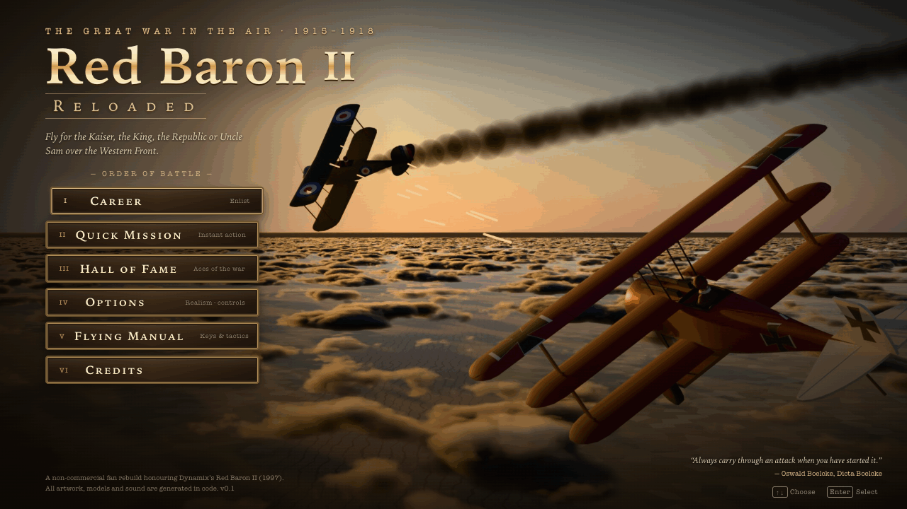

> **Fan project.** This is a non-commercial fan rebuild made out of admiration for the
> original. It uses no Dynamix or Sierra code, art or sound. "Red Baron" appears in the
> title only as a tribute. See [DECISIONS.md](DECISIONS.md) D-008.

## Play it

You need Node 22+, pnpm, and a desktop browser with WebGL2 and a real GPU (Chrome, Edge,
Safari or Firefox).

```sh
sfw pnpm install   # Socket Firewall wrapper; plain `pnpm install` also works
pnpm dev           # then open http://localhost:5173
```

For a static build, run `pnpm build`; the build goes into `dist/`, and `pnpm preview`
serves it. Careers and settings are saved in the browser's local storage.

On your first take-off, a one-page **Flying School** card explains the controls. You can
open it again from the **Flying Manual** on the main menu.

## What's in it

- **Career mode.** Enlist as a German, British, French or American pilot on any date from
  July 1915 to October 1918, in one of 32 historical squadrons. Squadrons include Jasta 2
  "Boelcke", Jasta 11, No. 56 Sqn, Naval 3, the Cigognes and the 94th "Hat in the Ring".
  - Each squadron flies the aircraft it had at that date.
  - You earn claims, which headquarters may or may not confirm.
  - You rise through the ranks and receive your nation's medals, up to the Pour le Mérite
    and the Victoria Cross.
  - A career also brings newspaper headlines, and you can be wounded, taken prisoner or
    killed.
  - 43 historical aces fly and die on their real schedules, and some of them turn up in
    your sky.
- **Missions:**
  - offensive and defensive patrols
  - escorts
  - interceptions of two-seaters
  - balloon attacks and balloon defence
  - ground attack
  - free hunts
- **Quick Mission.** Pick your aircraft, the enemy, numbers, skill, altitude, start
  position, time of day and cloud. You can also face a named ace such as Richthofen or
  Fonck.
- **23 aircraft.**
  - Flyable: from the Fokker E.III, D.H.2 and Nieuport 11 to the Fokker D.VII, SPAD XIII,
    S.E.5a, Camel and Bristol Fighter.
  - AI only: Rumpler, Halberstadt, R.E.8 and D.H.4 two-seaters.
  - Each type is tuned to its historical top speed and climb rate.
- **Flight and combat.**
  - Rotary-engine torque, so the Camel snaps into right turns.
  - Stalls and spins.
  - Wings that fail under too much load: don't dive an Albatros too steeply.
  - Gun jams, which you clear by hammering the breech.
  - Lewis gun drums that you change by hand.
  - Archie (anti-aircraft fire), balloons that burn, mid-air collisions.
  - Every one of these can be turned off under **Options → Realism**.
- **The Western Front at 1:1 scale.**
  - Flanders, Artois and the Somme, with real towns, rivers and airfields.
  - Front lines move with the date across 25 historical snapshots.
  - Trenches and shell craters, towns and farms, woods, the sea.
  - A sky that changes with the time of day, and clouds.
- **Views:**
  - cockpit with head look
  - padlock, which locks your view onto an enemy, as in the original
  - chase
  - fly-by
  - target view
- **Flying aids.** Time compression, wingman orders, a map overlay, and "end flight" when
  it's safe.
- **Controls.** Mouse-aim (point, and the aircraft follows), direct stick, gamepad, and
  rebindable keys.

## Controls (defaults)

| Action | Keys |
|---|---|
| Stick (pitch / roll) | ↑ ↓ ← → or W S A D · mouse-aim |
| Rudder | Z / X (or Q / E) |
| Throttle | = / − · 9 full · 0 cut · mouse wheel |
| Blip switch (rotary engines) | B |
| Fire | Space · left mouse button |
| Clear a jammed gun | U (press repeatedly) |
| Views | F1 cockpit · F2 chase · F3 fly-by · F4 / P padlock · F5 target |
| Targets | T cycle · Y padlock nearest |
| Look | right mouse (hold) · Numpad 4 / 6 / 2 / 8 |
| Wingmen | O orders card · 1 attack · 2 engage · 3 form up · 4 cover me · 5 go home |
| Time | K compress · L normal |
| Map, HUD, end flight, pause | M · H · N · Esc |

The full list of keys, with the gamepad mapping, is in the in-game **Flying Manual**. Any
key can be rebound under **Options → Keys**.

## How it's built

TypeScript, [Three.js](https://threejs.org) and Vite, with no UI framework. Everything is
generated by code; no assets come from anywhere else:

- **Aircraft models.** A parametric generator runs in headless Blender and builds every
  type from the historical data in `src/data/aircraft.ts`. The results are
  `public/models/*.glb`.
- **Liveries.** Squadron colours and insignia are painted onto the models when the game
  runs.
- **Key art.** Rendered with Cycles to `public/art/*.jpg`.
- **Terrain, sky, clouds and effects.** Procedural, in Three.js.
- **Sound and music.** Synthesised live with the Web Audio API.

To rebuild the models or the art:

```sh
node --experimental-strip-types tools/export-aircraft-json.ts
blender --background --factory-startup --python-exit-code 1 --python tools/blender/build_models.py
zsh tools/blender/render_art.sh
```

| Command | What it does |
|---|---|
| `pnpm test` | unit tests (Vitest): sim, AI, campaign, world, UI logic |
| `pnpm typecheck` | TypeScript check |
| `pnpm e2e` | Playwright browser tests (uses installed Chrome and the GPU; set `E2E_SWIFTSHADER=1` on machines without a GPU) |
| `node dev/walk-menus.mjs <url>` | screenshots every menu screen with real campaign data (dev server) |

Developer test pages served by `pnpm dev`:

- `/dev/world.html`: fly freely over the front.
- `/dev/hangar.html`: aircraft and liveries.
- `/dev/audio.html`: sound test bench.
- `/dev/ui.html`: screens with mock data.

More reading:

- [docs/ARCHITECTURE.md](docs/ARCHITECTURE.md): the module map.
- `docs/*.md`: one file per subsystem.
- [DECISIONS.md](DECISIONS.md): the log of design decisions.

## Screenshots

| | |
|---|---|
| 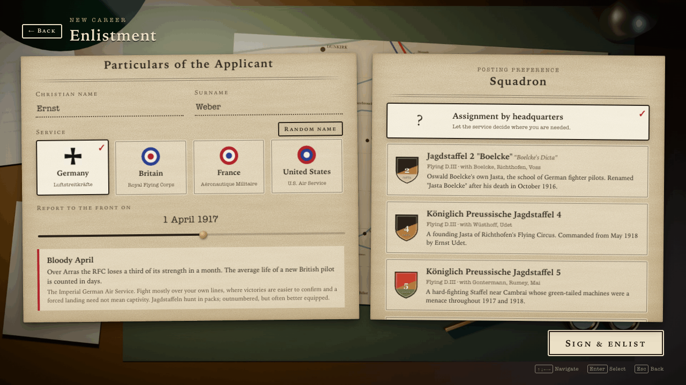 | 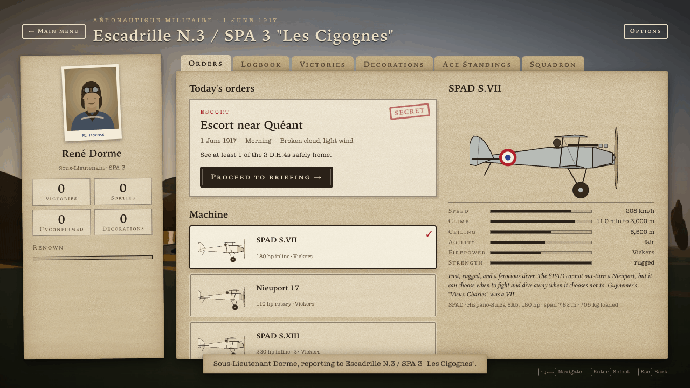 |
| 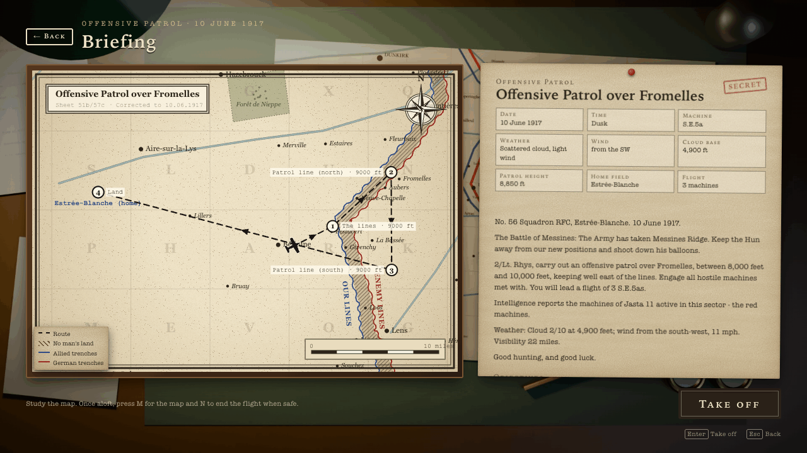 | 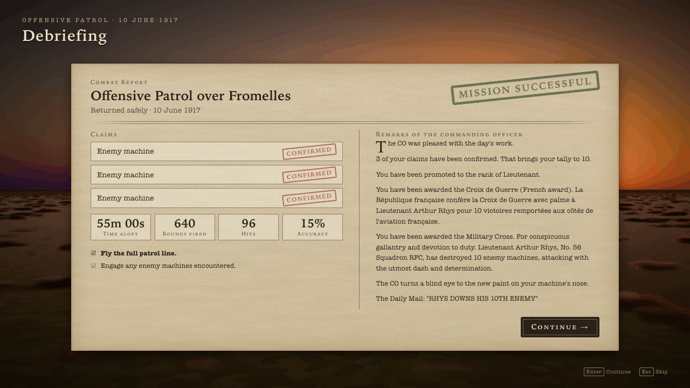 |
| 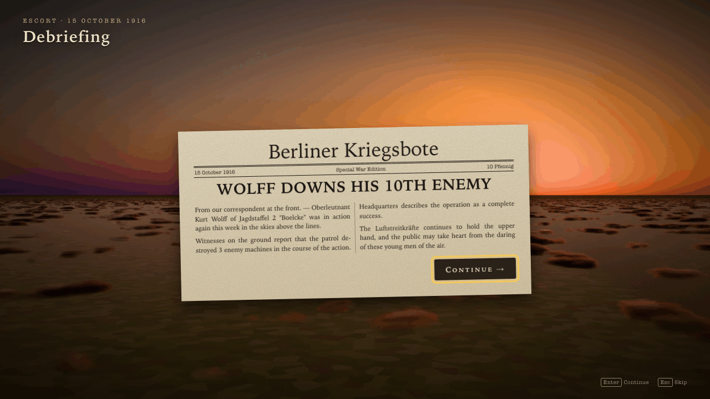 | 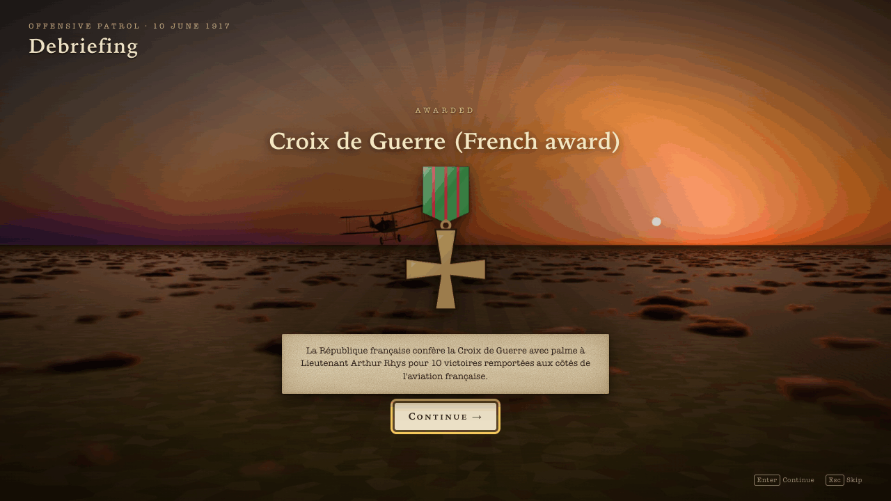 |
| 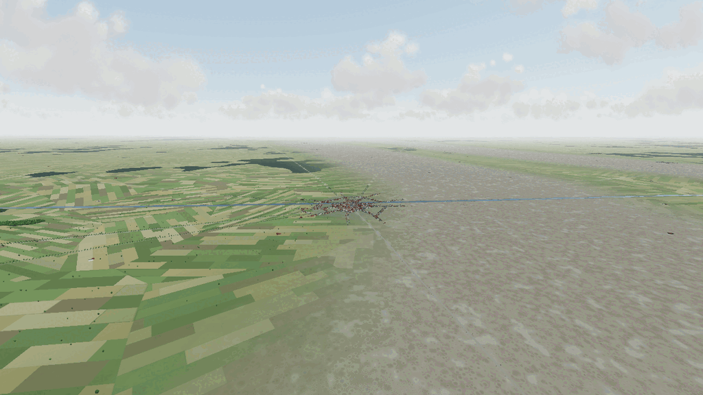 | 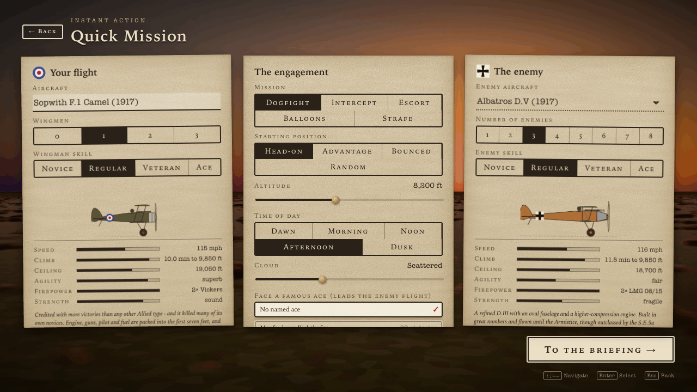 |

### In the air

Captured in real missions (HUD hidden) at the Ultra preset.

| | |
|---|---|
| 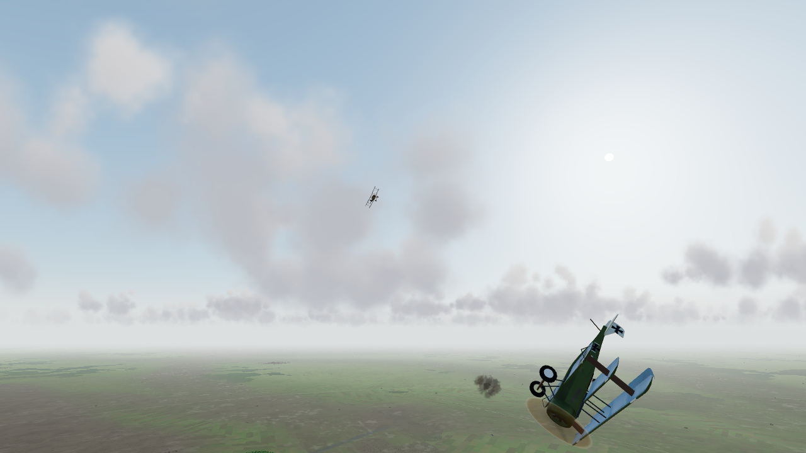 | 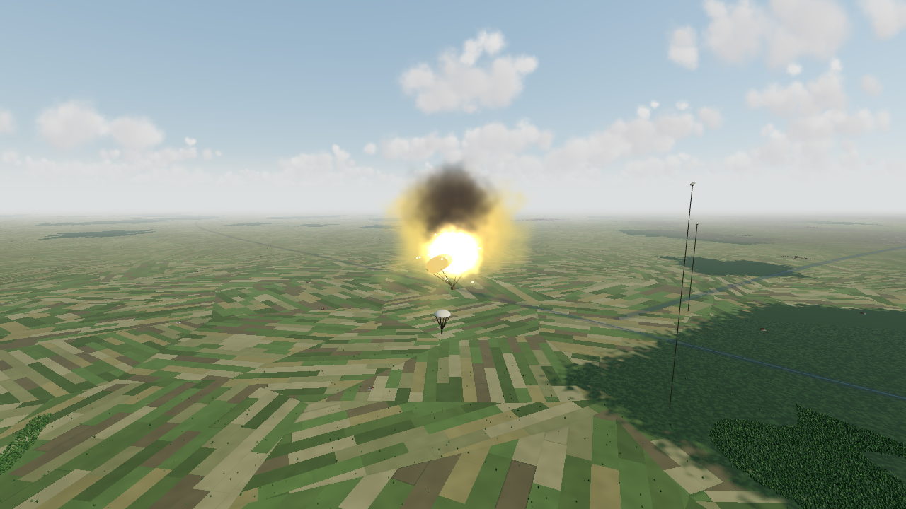 |
| 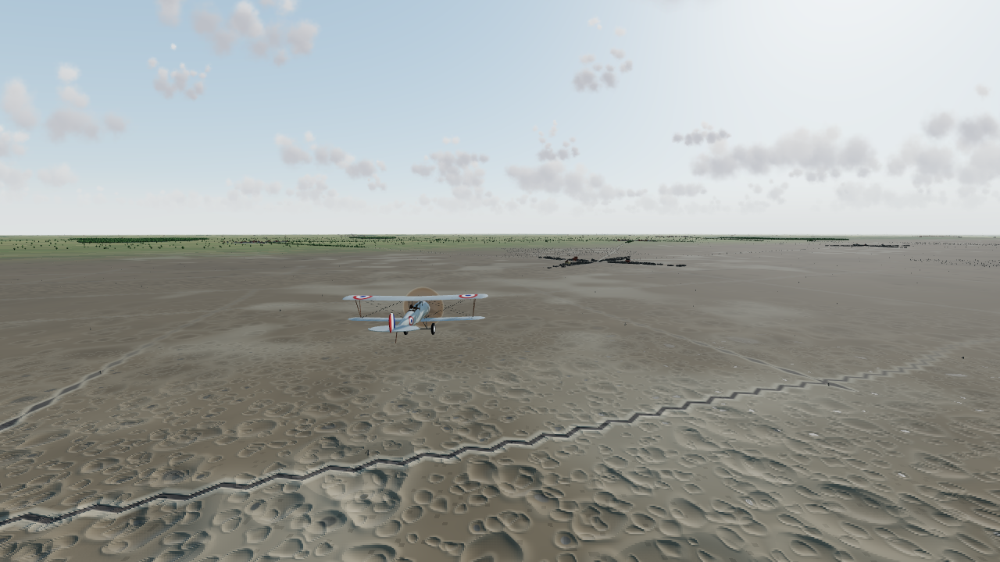 | 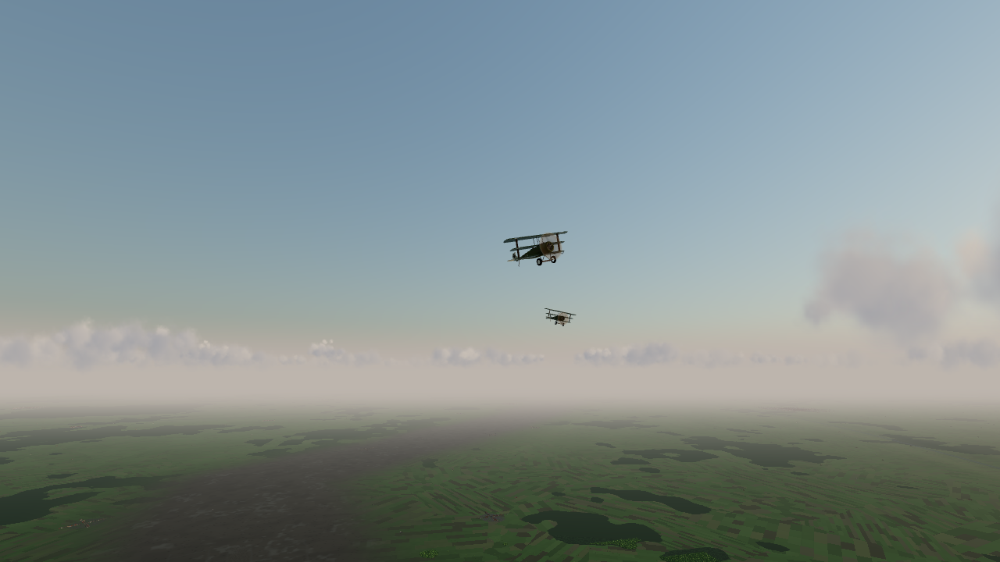 |
| 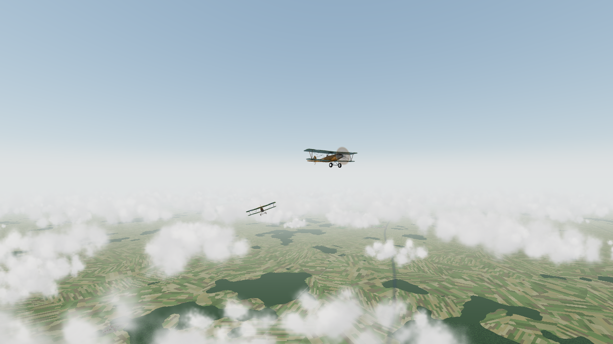 | 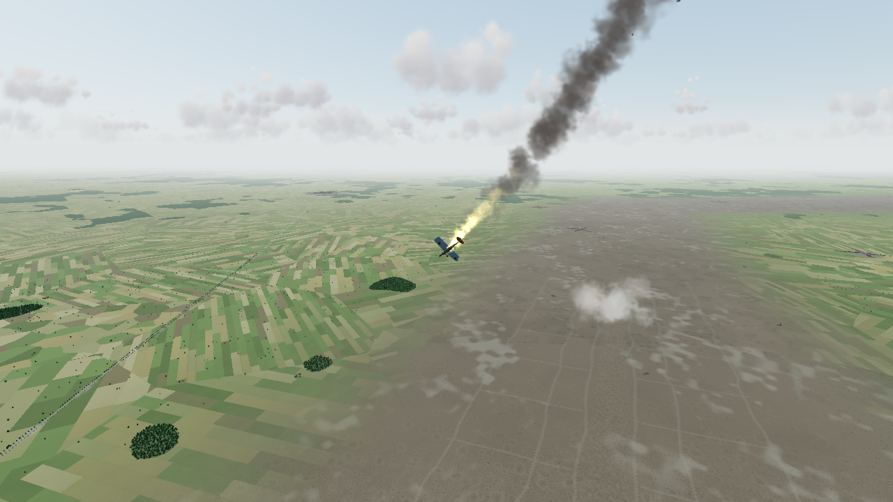 |
| 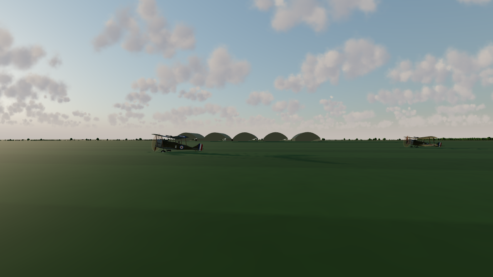 | |

*To the airmen of all nations, 1914–1918.*
